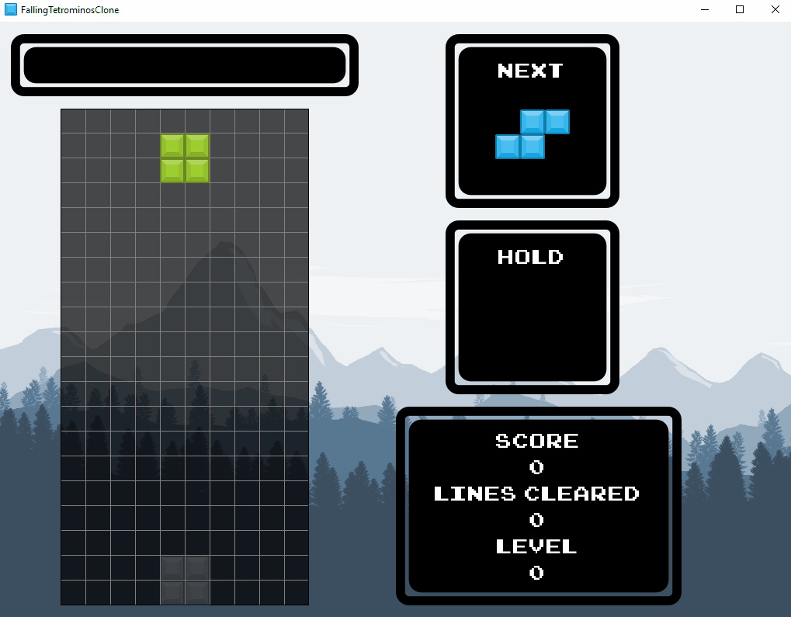
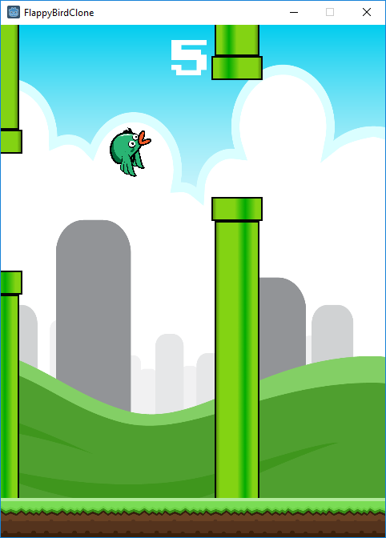
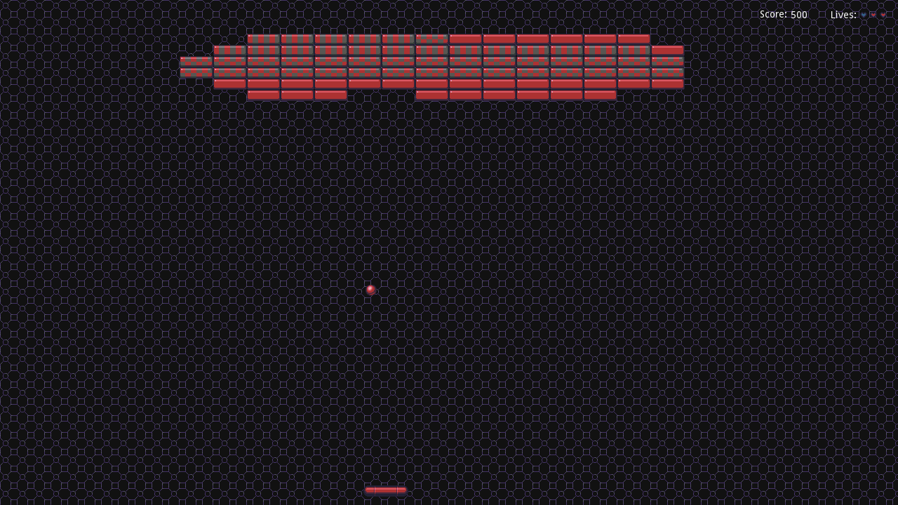

# Game Clone Index
Into the deep end with game development! In an effort to get properly started with game dev and to stop making excuses, I've decided to make clones of some common and fairly popular games and game genres, as well as some interesting mechanics I've come across. This repo acts as an index to group all of my game clone projects such that I can easily link to it in all of their own repos and I have a single entry point which I can update as the list grow.

## Game Clone Series
The individual projects here are listed in reverse chronological order with later projects appearing first.

---

### [Tetris](https://github.com/kazeraniman/FallingTetrominosClone)

A fairly complete clone of Tetris. The main goal of this project was to take what I had learned in the past clones and take it further with a more complex game. One great point of this project was giving me a chance to dive deeper into player interaction and game design as a whole, and how some small tweaks can greatly improve player experience (e.g. ghost pieces, wall-kicks, etc.).

---

### [Flappy Bird](https://github.com/kazeraniman/FlappyBirdClone)

A fairly complete clone of Flappy Bird. The main goal of this project was to become more familiar with the engine and to try making a more complete experience. As the scope of this game is quite small, it provided a good opportunity to match most of the functionality of the original while giving me more experience with polish elements like proper UI and using the animation systems that Godot provides.

---

### [Breakout](https://github.com/kazeraniman/BreakoutClone)

An entry-level clone of Breakout. The main goal of this project was to become familiar with Godot as an engine and some of the tools it provides. Additionally, Godot's primary scripting language GDScript, while similar to Python, was new to me and so needed to be explored here. This project is severely lacking in the polish department but serves as a jump-off point for future projects.

